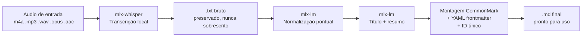

# 🎙️ Transcrição Local via MLX — IA Soberana em Apple Silicon


**Pipeline pessoal de transcrição e pós-processamento de áudio, 100% local, rodando inteiramente em Apple Silicon via MLX — sem envio de áudio ou texto a nenhum servidor externo.**

> **Autoria:** João Pedro Simões Rodrigues (OAB/GO 105020056).
> Projeto de pesquisa aplicada e pertencente ao portfólio técnico da **[Leginova](https://leginova.org)**, desenvolvido e mantido de forma independente por seu autor. Não é um produto comercial da Leginova — é a prova de conceito de um princípio técnico que orienta o trabalho da empresa: **processamento de dados sensíveis sem dependência de provedores de nuvem externos.**

---

## 🕊️ IA Soberana e a Leginova

Este projeto nasce de uma pergunta simples: por que transcrever e processar um áudio pessoal ou profissional precisaria, por padrão, passar por um servidor de terceiros?

A resposta técnica é que não precisa. Este pipeline demonstra, em código funcional, que é possível rodar transcrição de fala (`mlx-whisper`) e normalização/resumo por modelo de linguagem (`mlx-lm`) **inteiramente na própria máquina**, aproveitando o hardware unificado da Apple Silicon — sem que uma única palavra do conteúdo saia do dispositivo.

Isso importa além da conveniência técnica. Para profissionais que lidam com dados sensíveis — jurídicos, institucionais, de saúde, ou simplesmente pessoais — depender de nuvens estrangeiras para processar esse conteúdo é uma escolha de arquitetura com implicações reais de privacidade, soberania de dados e conformidade com a LGPD (que trata a minimização de dados e o controle sobre o tratamento como princípios centrais, não como detalhes de implementação).

Esse é o mesmo princípio que orienta a frente de jurimetria da Leginova: um compromisso com IA **100% local, aberta e desenhada para privacidade desde a concepção** — uma escolha estrutural, não apenas uma feature. Este repositório é uma peça independente desse compromisso mais amplo: um pipeline de propósito geral, aberto, que qualquer pessoa pode auditar, rodar e adaptar, e que serve como evidência técnica pública de que essa abordagem é viável hoje, em hardware de consumo, sem concessões relevantes de qualidade.

Mais contexto sobre esse posicionamento está em [`docs/IA_SOBERANA_E_A_LEGINOVA.md`](docs/IA_SOBERANA_E_A_LEGINOVA.md).

---

## O que o pipeline faz



1. **Transcrição** — `mlx-whisper` converte o áudio em texto bruto, localmente.
2. **Normalização pontual** — `mlx-lm` corrige erros óbvios de transcrição (palavras trocadas, pontuação, nomes próprios), sem resumir, cortar ou alterar o sentido original.
3. **Resumo** — o mesmo modelo, já carregado em memória, gera um título curto e um sumário de 2–3 frases.
4. **Markdown final** — tudo é montado em um único arquivo `.md`, em CommonMark puro, com metadados em YAML no topo.

Detalhes completos da arquitetura em [`docs/ARQUITETURA.md`](docs/ARQUITETURA.md).

---

## Pré-requisitos

- macOS em Apple Silicon (M1/M2/M3 ou superior)
- [Homebrew](https://brew.sh)
- [`uv`](https://docs.astral.sh/uv/) — gerenciador de pacotes/ambientes Python
- `ffmpeg` (`brew install ffmpeg`)

## Instalação

```bash
git clone https://github.com/joaopsimoesr/pipeline_transcricao_e_tratamento_audios_local_via_MLX_on_apple_silicon.git
cd pipeline_transcricao_e_tratamento_audios_local_via_MLX_on_apple_silicon

uv sync           # cria o ambiente virtual e instala mlx-whisper e mlx-lm
chmod +x src/transcrever.sh
```

Na primeira execução, os modelos são baixados automaticamente (Whisper large-v3-turbo ~1,6 GB; modelo de linguagem local ~1,8 GB) e ficam em cache para usos futuros.

## Uso

```bash
source .venv/bin/activate

./src/transcrever.sh "caminho/para/audio.m4a" pt "vocabulário técnico opcional, nomes próprios"
```

| Argumento | Obrigatório | Valores | Descrição |
|---|---|---|---|
| Caminho do áudio | Sim | qualquer `.m4a`/`.mp3`/`.wav`/`.aac`/`.opus` | Arquivo de entrada |
| Idioma | Não (padrão `auto`) | `pt` \| `en` \| `es` \| `auto` | Força o idioma ou usa detecção automática |
| Prompt inicial | Não | texto livre | Vocabulário/nomes próprios para reduzir erros de transcrição |

### Exemplo

```bash
./src/transcrever.sh "audios/reuniao-de-equipe-cronograma.m4a" pt "cronograma, planilhas, captação de recursos"
```

Saída:
- `textos/reuniao-de-equipe-cronograma.txt` — transcrição bruta (nunca editada)
- `markdown/reuniao-de-equipe-cronograma.md` — versão final normalizada, com frontmatter YAML e resumo

---

## Por que isso importa: privacidade por padrão

- Nenhuma chamada de rede é feita durante a transcrição ou o pós-processamento — todo o processamento acontece no processo local.
- Nenhuma credencial, chave de API ou dado de terceiros é necessário para rodar o pipeline.
- O texto bruto é sempre preservado separadamente do texto normalizado, permitindo auditoria do que a IA alterou.

## Roadmap

- [ ] Suporte a diarização de falantes (múltiplos participantes)
- [ ] Interface de linha de comando mais completa (`argparse`/`click`) em substituição aos argumentos posicionais do bash
- [ ] Testes automatizados
- [ ] Integração opcional com Obsidian (exportação direta para vault)

## Contribuindo

Contribuições são bem-vindas — veja [`CONTRIBUTING.md`](CONTRIBUTING.md).

## Segurança e privacidade

Veja [`SECURITY.md`](SECURITY.md) para a política de reporte de problemas.

## Licença

Distribuído sob a licença MIT — veja [`LICENSE`](LICENSE).

## Autor

**João Pedro Simões Rodrigues** — OAB/GO 105020056
Fundador da [Leginova](https://leginova.org)
