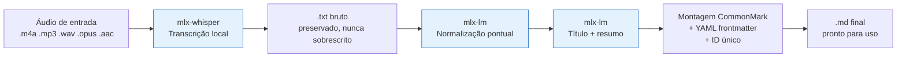

# 🏗️ Arquitetura do Pipeline

## Visão geral



## Componentes

### 1. `src/transcrever.sh` — orquestrador

Script bash que coordena o pipeline em até seis etapas:

0. **(Se `.qta`)** Extrai a trilha de áudio compatível (AAC) via `ffmpeg`, sem reencodar.
1. Transcreve — via `mlx-whisper` (padrão) ou via `whispermlx` com diarização (`--diarizar`).
2. **(Se diarizado)** Converte o JSON de segmentos com falantes em turnos de texto.
3. Sanity check de loop de repetição (ver seção de diagnóstico).
4. Invoca `src/mlx_postproc.py` para sanitização + título/resumo.
5. Gera o Cluster-ID.
6. Monta o `.md` final com frontmatter YAML.

### 2. `src/mlx_postproc.py` — sanitização e resumo via IA local

Detecta automaticamente se a entrada é diarizada (linhas `[SPEAKER_XX] texto`) ou texto corrido, e aplica a estratégia correspondente:

- **Sem diarização**: normalização pontual de erros óbvios de transcrição, como antes.
- **Com diarização**: sanitização por lotes de turnos (`TURNOS_POR_LOTE = 12`), removendo apenas ruído de fala (hesitações, muletas, falsos começos) e preservando etiquetas de falante e todo o conteúdo substantivo. O processamento em lotes existe para não estourar o orçamento de tokens de saída do modelo em reuniões longas — o objetivo é preservar conteúdo, então cada lote sanitizado não deve sair menor que o lote original.

Carrega o modelo `mlx-lm` **uma única vez** por execução, reaproveitado em todas as chamadas de sanitização e na geração de título/resumo.

### 3. `src/diarizacao_para_txt.py` — conversão de diarização para texto

Lê o JSON produzido pelo `whispermlx` (segmentos com campo `speaker`), funde segmentos consecutivos do mesmo falante em turnos únicos, e escreve um `.txt` no formato `[SPEAKER_00] texto...` — que entra no restante do pipeline exatamente como um `.txt` bruto comum.

## Diarização (opcional)

Ativada com a flag `--diarizar`. Usa [`whispermlx`](https://github.com/KalebJS/whispermlx), um fork do WhisperX com backend `mlx-whisper`, que integra `pyannote.audio` para identificar quem fala.

**Pré-requisitos:**
1. `uv sync --extra diarizacao` (instala `whispermlx`).
2. Uma conta gratuita na Hugging Face, com um [token de acesso](https://huggingface.co/settings/tokens).
3. Aceitar os termos do modelo [`pyannote/speaker-diarization-community-1`](https://huggingface.co/pyannote/speaker-diarization-community-1) (é gratuito, mas gated — precisa de aceite explícito).
4. `export HF_TOKEN="seu_token"` antes de rodar `transcrever.sh --diarizar`.

**Sobre a etapa gated**: isso não compromete o princípio de "processamento 100% local" do pipeline — é o mesmo padrão já usado para baixar os pesos do Whisper e do Llama (download único via Hugging Face). A diferença é que este modelo específico exige aceite explícito de termos antes do download, em vez de ser público. Depois de baixado, a inferência roda inteiramente local, como o resto do pipeline.

**[PROVAVELMENTE INCOMPLETO - POC]** As flags de saída do `whispermlx` CLI (`--output_format`, `--output_dir`, `--output_name`) usadas em `transcrever.sh` seguem a convenção do WhisperX original, mas não foram confirmadas na versão específica instalada. Rode `whispermlx --help` antes do primeiro uso com diarização.

## Suporte a `.qta` (QuickTime Audio)

Formato nativo do app Notas de Voz em iPhones 16 Pro/Pro Max e superiores (desde iOS 18.2), usado também mais amplamente a partir do iOS 26. É um contêiner QuickTime/MOV com múltiplas trilhas: uma trilha AAC estéreo compatível, uma trilha de áudio espacial (First Order Ambisonics, capturada pelos 4 microfones do aparelho) e trilhas de metadados.

O pipeline detecta a extensão `.qta` e extrai automaticamente a trilha 0 (AAC) via `ffmpeg -map 0:0 -c:a copy` — cópia direta, sem reencodar, portanto sem perda de qualidade e quase instantânea.

## Limitações conhecidas

- Detecção automática de idioma é menos confiável em trechos curtos ou com forte sotaque/mistura de idiomas.
- A qualidade da sanitização depende do modelo de linguagem local escolhido.
- Diarização não identifica *nomes* de falantes automaticamente — apenas rótulos genéricos (`SPEAKER_00`, `SPEAKER_01`...). Mapear rótulo → nome real ainda é um passo manual.

## Diagnóstico de loop de repetição (falha observada em produção — v0.1.1)

**Sintoma:** o `.txt` bruto (e consequentemente o `.md` final) contém a mesma frase repetida dezenas ou centenas de vezes, geralmente até o fim do arquivo.

**Causa:** esta é uma falha conhecida e documentada do Whisper, não um bug do pipeline. Dois fatores se combinam:

1. Por padrão, o Whisper decodifica cada trecho de ~30s **condicionado ao texto do trecho anterior** (`condition_on_previous_text=True`). Se um trecho produz uma alucinação ou repetição, os trechos seguintes tendem a se ancorar nela, criando um loop autoalimentado.
2. Silêncio, ruído de fundo, respiração ou fala hesitante fazem o modelo "inventar" texto em vez de reconhecer ausência de fala — comportamento que os limiares `--no-speech-threshold`, `--logprob-threshold` e `--compression-ratio-threshold` existem para mitigar.

**Mitigação aplicada por padrão desde a v0.1.1** (`src/transcrever.sh`):

- `--condition-on-previous-text False` — cada trecho é decodificado de forma independente, evitando a propagação da alucinação.
- `--no-speech-threshold 0.6 --logprob-threshold -1.0 --compression-ratio-threshold 2.4` — torna o modelo mais conservador diante de trechos de baixa confiança.
- Um **sanity check pós-transcrição**: se qualquer linha do `.txt` bruto se repete mais de 15 vezes, o pipeline interrompe antes da etapa de IA (evitando gastar tempo/RAM normalizando uma transcrição já inutilizável) e imprime instruções de diagnóstico. `src/mlx_postproc.py` tem a mesma verificação como segunda camada de defesa.

**Se o loop persistir mesmo com essas flags:**

1. Gere a saída em JSON para localizar o timestamp exato onde o loop começa:
   ```bash
   mlx_whisper "audio.m4a" --model mlx-community/whisper-large-v3-turbo --language pt \
     --output-format json --output-name debug --output-dir /tmp
   ```
   Inspecione os campos `compression_ratio` e `avg_logprob` por segmento em `/tmp/debug.json` — o segmento onde o loop começa costuma ter `compression_ratio` anormalmente baixo ou `avg_logprob` anormalmente negativo.
2. Ouça o áudio original no timestamp identificado — geralmente há ruído de fundo, uma pausa longa, ou fala hesitante/repetitiva real do falante nesse ponto.
3. Se o problema for ruído de fundo, pré-processe o áudio antes de transcrever:
   ```bash
   ffmpeg -i entrada.m4a -af "highpass=f=100, afftdn=nf=-25" saida_limpa.m4a
   ```
4. Como último recurso, corte manualmente o trecho problemático do áudio (`ffmpeg -ss` / `-to`) e transcreva em duas partes.
